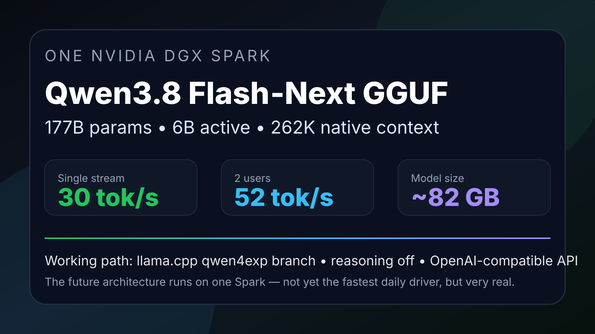

# Qwen3.8 Flash-Next GGUF on one DGX Spark



Native llama.cpp recipe for running `unsloth/Qwen3.8-Flash-Next-GGUF` on a single NVIDIA DGX Spark / GB10.

This is a field-tested setup, not a theoretical one. The model loads on one Spark, exposes an OpenAI-compatible endpoint, and works with agent clients when thinking mode is disabled.

## Why this repo exists

`Qwen3.8-Flash-Next` is not a normal Qwen checkpoint. It uses the new `qwen4exp` architecture, with hybrid attention, Qwen Sparse Attention, Gated DeltaNet, n-gram embeddings, MoE, vision support, and a native 262,144-token context window.

At the time of this recipe, stock llama.cpp did not load the GGUF for us:

```text
unknown model architecture: 'qwen4exp'
```

The working path was the llama.cpp Qwen4 experimental PR branch, then a conservative serve profile tuned for DGX Spark unified memory.

## Tested hardware

| Component | Value |
|---|---|
| Machine | NVIDIA DGX Spark / GB10 |
| Memory | 128 GB unified memory |
| Storage | 1 TB NVMe |
| Runtime | llama.cpp custom `qwen4exp` branch |
| Model | `unsloth/Qwen3.8-Flash-Next-GGUF` |
| Quant tested | `UD-IQ3_XXS` |
| GGUF size | ~82 GB |
| Architecture shown by runtime | `qwen4exp` |
| Native context | 262,144 tokens |

## What worked for production testing

This was the stable interactive profile:

```bash
/home/sojufx/llama.cpp/build-qwen4exp/bin/llama-server \
  -m /opt/huggingface/models/Qwen3.8-Flash-Next-GGUF-UD-IQ3_XXS/UD-IQ3_XXS/Qwen3.8-Flash-Next-UD-IQ3_XXS-00001-of-00003.gguf \
  --host 0.0.0.0 \
  --port 8000 \
  --alias ornith \
  --api-key YOUR_API_KEY \
  --ctx-size 131072 \
  --parallel 2 \
  --cont-batching \
  --cache-prompt \
  --batch-size 1024 \
  --ubatch-size 256 \
  --reasoning off
```

Important llama.cpp detail:

```text
ctx-size is split across slots.
--ctx-size 131072 --parallel 2 = 2 slots × 65536 tokens each.
```

For one very deep context session, this also loaded:

```bash
--ctx-size 262144 --parallel 1
```

That gives one full 262K slot. It is not the best multi-user production profile.

## Benchmark snapshot

Benchmark prompt: local OpenAI-compatible streaming code-generation test.

| Load | Result |
|---|---:|
| C1 | 30.2 tok/s |
| C2 | 52.4 tok/s aggregate, ~26 tok/s per stream |
| C4 | 52.6 tok/s aggregate, queued because only 2 slots |
| TTFT C1 | ~0.6 s |
| RAM after load | ~85–93 GiB observed |

This is not faster than our best vLLM NVFP4 recipes, but it is interesting because it gets a huge 177B-param / 6B-active class model running locally on one Spark.

## The big gotcha: thinking mode

Qwen3.8 Flash-Next thinks by default. On llama.cpp, our first normal API request returned only `reasoning_content` and hit `finish_reason="length"` with empty final `content`.

For agent clients and OpenAI-compatible tools, use:

```bash
--reasoning off
```

or send request-level:

```json
{
  "reasoning_effort": "none"
}
```

Without this, clients like Hermes/OpenCode may look stuck because the model spends its entire output budget inside hidden reasoning.

Recommended non-thinking sampling from the upstream model card:

```json
{
  "temperature": 0.7,
  "top_p": 0.8,
  "top_k": 20,
  "presence_penalty": 1.5
}
```

## Build llama.cpp with Qwen4 experimental support

```bash
git clone https://github.com/ggerganov/llama.cpp.git
cd llama.cpp

# Use a branch/PR that contains qwen4exp support.
# The exact branch name may change; this repo records the tested build in notes below.
git fetch origin pull/27742/head:qwen4exp-pr-27742
git checkout qwen4exp-pr-27742

cmake -B build-qwen4exp -DGGML_CUDA=ON -DCMAKE_CUDA_ARCHITECTURES=121a
cmake --build build-qwen4exp -j --target llama-server llama-cli
```

Tested runtime printed:

```text
llama.cpp build 10656, commit 035e22731
```

## Download the model

```bash
huggingface-cli download unsloth/Qwen3.8-Flash-Next-GGUF \
  --include "UD-IQ3_XXS/*" \
  --local-dir /opt/huggingface/models/Qwen3.8-Flash-Next-GGUF-UD-IQ3_XXS
```

The first shard is the entrypoint file:

```text
UD-IQ3_XXS/Qwen3.8-Flash-Next-UD-IQ3_XXS-00001-of-00003.gguf
```

## Why not vLLM yet?

The Hugging Face page includes generic vLLM instructions, but for this GGUF we found the practical path today is llama.cpp with `qwen4exp` support. vLLM may become the right route later, especially when qwen4exp support lands cleanly and batching/speculative decode mature for this architecture.

## Current recommendation

For experimenting:

```text
Flash-Next GGUF is worth trying.
```

For production speed with multiple users on one Spark:

```text
Use a mature vLLM NVFP4 model such as Qwen3.6 35B-A3B, Laguna S 2.1, or Nemotron 3.5 Lightning.
```

This model is the “future is leaking through the wall” setup. It runs, it is fascinating, but it is not yet the fastest daily-driver recipe on one Spark.

## Sources

- Model card: https://huggingface.co/unsloth/Qwen3.8-Flash-Next-GGUF
- Qwen3.8 Flash-Next blog/technical report links are referenced from the model card.
- llama.cpp: https://github.com/ggerganov/llama.cpp

## License

Recipe code and docs in this repo are Apache-2.0.

The model weights are governed by the upstream model license on Hugging Face.
